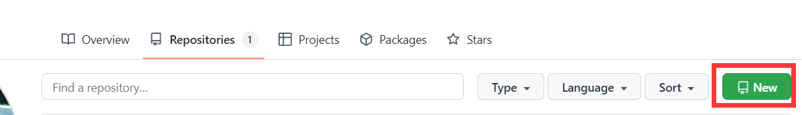
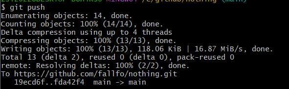
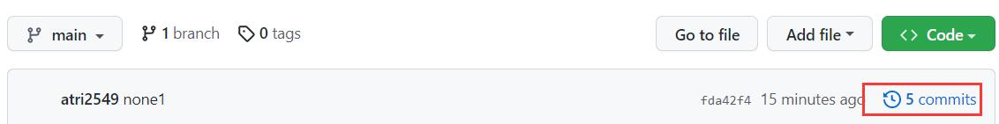
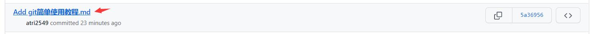

# git简单使用教程

~~本教程真的水，建议不看~~

## 1、下载git

以`win10`为例，进入[[官网]](https://git-scm.com/)下载windows版本，`next`按到底即可


## 2、常用操作

### a. 创建代码仓

登录[[GitHub]](https://github.com/)，进入个人页面创建一个新的repository




### b. Git Bash Here

安装好git后，鼠标右建新增`Git Bash Here`操作，可以使用一些命令操作，例如`ls`


### c. git clone

以本仓库为例，进入代码仓，copy下网址


然后在你的本地路径下，右键点击`Git Bash Here`，输入如下指令可以下载代码仓

```bash
git clone https://github.com/fallfo/nothing.git
```


### d. git status 

接下来`cd`进入clone的代码仓库，在该文件夹下增删修改文件均会记录状态，可以通过`git status`指令查看


### e. git add && git commit

如果代码状态无误，可以通过指令`git add .`将所有修改提交，然后通过指令`git commit -m "更新说明"`记录这次更新的目的


ps. 初次`commit`需要设置`user.name` `user.email`

```bash
git config --global user.name "yourname"
git config --global user.email "your-mail@mail.com"
```


### f. git push

`commit`之后可以通过指令`git push`上传修改，初次使用会弹窗，可选择浏览器然后与GitHub账号绑定。



提交完成后，打开网址可以看到代码已经上传，且commits处有上传的记录可以看到此次上传的具体修改。






至此，基础操作完成。其他

